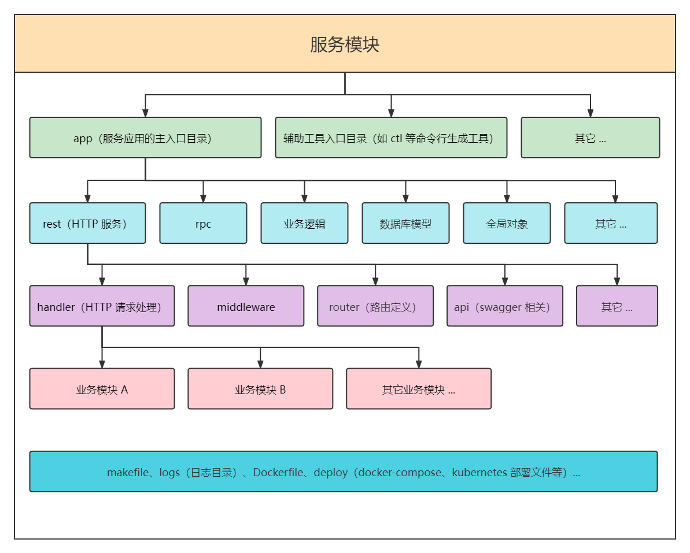
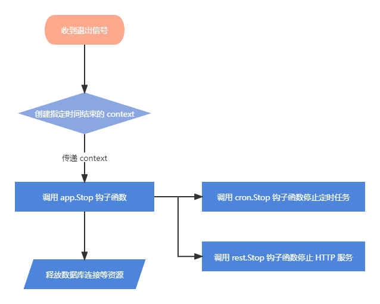

# `Go` 开发基础脚手架

## 架构图



## 目录结构

- `bin`：二进制文件输入目录
- `cmd`：编译入口
  - `app`：主程序编译入口
  - 辅助程序编译入口目录（如 `ctl` 等命令行生成工具）
  - ...
- `deploy`：环境和部署相关目录
  - `docker-compose`：`docker-compose` 容器编排目录
  - `kubernetes`: `k8s` 编排配置目录
  - ...
- `docs`：文档目录
- `etc`：配置文件目录
- `internal`：
  - `app`：主程序逻辑代码
    - `cli`：命令行功能模块
      - `command`：命令行功能入口
        - 模块目录
        - ...
      - `pkg`：功能增强包目录
      - `script`：临时脚本
        - ...
    - `config`：主程序配置模型
    - `cron`：`cron` 定时任务功能模块
      - `job`: `cron` 任务
        - ...
    - `global`：全局对象
    - `model`：数据库模型
    - `pkg`：功能增强包目录
    - `rest`：`HTTP` 功能模块
      - `api`：`api` 文档相关定义
        - `docs`：`swagger` 生成的定义文件
      - `config`：`rest` 配置模型
      - `handler`：`HTTP` 请求处理入口
        - 模块目录
        - ...
      - `middleware`：中间件目录
      - `pkg`：功能增强包目录
      - `router`：路由定义目录
    - `rpc`：`RPC` 功能模块
    - `service`：逻辑代码
      - 模块目录
      - ...
    - 其它功能模块
- `logs`：日志文件生成目录
- `pkg`：功能类库
 
# `app` 主程序

## 生命周期

### 程序启动生命周期


### 程序结束生命周期



## 如何运行

### `go build` 或 `go run`

1. `go build` 方式

```shell
$ go build -o bin/app cmd/app/main.go 
$ ./bin/app
```

2. `go run` 方式

```shell
$ go run cmd/app/main.go 
```

### `make`

```shell
 # 下载依赖
$ make download
$ make build

# 或依据平台编译
$ make linux-build
$ make windows-build
$ make mac-build

# 运行
$ ./bin/app
```

### `docker-compose`

`docker-compose` 的启动方式有两种，一种是基于 `air` 镜像，一种是基于 `Dockerfile` 来构建镜像

- 基于 `air` 镜像的方式只适用于开发阶段，请勿用于生产环境
- 基于 `Dockerfile` 的方式如果用于开发阶段，修改的代码将不会更新，除非在 `docker-compose` 启动时指定 `--build` 参数，但是这将会导致每次启动时都重新构建镜像，可能需要等待很长时间

> 注意：基于 `air` 镜像启动时，在 `Windows` 系统环境下，热更新可能不会生效，这是因为 `fsnotify` 无法收到 `wsl` 文件系统的变更通知

```shell
# 基于 air 
$ docker-compose -f deploy/docker-compose/docker-compose-dev.yaml up

# 基于 Dockerfile
$ docker-compose -f deploy/docker-compose/docker-compose.yaml up
```

### 热重启

热重启功能基于 `air` 包，[文档地址](https://github.com/cosmtrek/air)

```shell
$ air
```

### 运行子命令或脚本

命令行程序功能基于 `cobra` 包，[文档地址](https://github.com/cosmtrek/air)

```shell
$ ./bin/app [标志] <子命令> [标志] [参数]

# 帮助信息
$ ./bin/app -h
$ ./bin/app <子命令> -h
```

## 配置

配置文件位于 `etc` 目录中，如果位于其它位置，需要在运行程序时通过 `-f` 参数指定其位置（默认配置文件路径：`etc/app.yaml`）

配置文件的内容在程序启动的最初就会被加载到 `app` 全局配置实例中，为了方便管理和维护各个子服务模块的配置，在 `app` 全局配置实例中，对各个子服务模块的配置进行了拆分，分散到其独立的配置实例中

配置规范：

1. 如果子服务模块需要定义配置，那么在 `etc/app.yaml` 配置文件中，必须将子服务模块名称作为最顶层 `key` 展开配置
2. 在子服务模块目录中新建 `config/config.go` 文件，在此文件中定义子服务模块配置文件的映射模型

例：

`app` 全局配置定义

```go
type (
	Config struct {
		App  `mapstructure:",squash"`
		REST restconfig.Config `mapstructure:"REST"` // rest 服务配置
	}

	App struct {
		Env              Env
		ShutdownWaitTime int
		Log              *logger.Config
		DB               *orm.Config
		Redis            *redisclient.Config
	}
)
```

`rest` 服务模块配置定义

```go
type (
	Config struct {
		Host        string
		Port        int
		ExternalUrl string
		Jwt         Jwt
	}

	Jwt struct {
		Key    string
		Expire time.Duration
	}
)
```

在配置文件更改后，无需重启服务，更改内容会自动同步到配置实例中

- `app` 全局配置实例的定义位于 `internal/app/config/config.go` 中
- `rest` 服务配置实例的定义位于 `internal/app/rest/config/config.go` 中
- 子服务模块配置实例的定义应位于 `internal/app/<子服务模块>/config/config.go` 中

不提供直接使用 `viper` 包直接通过键名来获取配置值的方法，而统一使用 `global.Config()` 来获取，避免快捷方式的滥用造成后期的维护困难

## 全局对象

在程序启动时，会根据配置文件，将数据库、`Redis`、日志等实例初始化到全局对象上

全局对象实例的定义位于 `internal/app/global/global.go` 中

```go
var (
    command      *cobra.Command         // 根命令实例
	loggerOutput *rotatelogs.RotateLogs // 日志输出实例
	conf         *config.Config         // 配置实例
	logger       *zap.Logger            // 日志实例
	db           *gorm.DB               // 数据库实例
	redisClient  *redis.Client          // redis 实例
)
```

## 日志

日志实例获取：`global.Logger()`

日志基于 `zap` 包，[文档地址](https://github.com/uber-go/zap)

日志内容统一输出到 `logs` 目录中，并且将会按照每天的日期进行分割，如果需要将其它日志信息写入到此目录的日志文件中，需要获取此目录文件的操作实例，获取方式：`global.LoggerOutput()`

## `ORM`

`ORM` 实例获取：`global.DB()`

`ORM` 基于 `gorm` 包，[文档地址](https://github.com/go-gorm/gorm)

## `Redis` 客户端

`Redis` 客户端实例获取：`global.RedisClient()`

`Redis` 客户端基于 `redis` 包，[文档地址](https://github.com/go-redis/redis)

## `rest` 功能模块

`rest` 功能模块基于 `gin` 提供的 `HTTP` 相关功能，[文档地址](https://github.com/gin-gonic/gin)

### 数据校验和绑定

在 `internal/app/rest/pkg/bindx` 包中，对 `gin` 的 `ShouldBind` 系列方法、参数校验以及 `validator` 包错误信息的翻译进行了封装

在参数校验失败后，会对错误信息进行翻译，然后以预定的 `HTTP` 响应码和业务响应码进行 `JSON` 响应

`ShouldBind` 系列函数绑定的结构体必须实现 `bindx` 包中的 `BindModel` 接口，`ErrorMessage` 方法返回一个 `map`，此 `map` 是“字段.校验规则”与错误信息的键值对

`BindModel` 接口定义：

```go
type BindModel interface {
    ErrorMessage() map[string]string
}
```

例：

```go
type HelloReq struct {
    Name string `form:"name" binding:"required"`
}

func (HelloReq) ErrorMessage() map[string]string {
	return map[string]string{
		"Name.required": "名称不能为空",
	}
}
```

绑定函数会返回一个 `error`，如果 `error` 不为 `nil`，则应记录错误信息，并立即 `return` 中止函数的执行

绑定函数定义（和 `gin` 的 `ShouldBind` 系列方法对应）：

```go
func ShouldBindDefault(ctx *gin.Context, m BindModel) error
func ShouldBindJSON(ctx *gin.Context, m BindModel) error
func ShouldBindXML(ctx *gin.Context, m BindModel) error
func ShouldBindQuery(ctx *gin.Context, m BindModel) error
func ShouldBindYAML(ctx *gin.Context, m BindModel) error
func ShouldBindHeader(ctx *gin.Context, m BindModel) error
func ShouldBindUri(ctx *gin.Context, m BindModel) error
func ShouldBindWith(ctx *gin.Context, b binding.Binding, m BindModel) error
func ShouldBindBodyWith(ctx *gin.Context, b binding.Binding, m BindModel) error
```

例：

```go
// 自动根据请求头的 Content-Type 来进行对应的绑定
if err := bindx.ShouldBindDefault(ctx, req); err != nil {
    h.logger.Error(err.Error())
    return
}

// 绑定 JSON 类型的请求数据
if err := !bindx.ShouldBindJSON(ctx, req); err != nil {
    h.logger.Error(err.Error())
    return
}

// 绑定 form-data 和 x-www-form-urlencoded 类型的请求数据
if err := !bindx.ShouldBindQuery(ctx, req); err != nil {
    h.logger.Error(err.Error())
    return
}
```

### 响应

在 `internal/app/rest/pkg/responsex` 包中，对 `JSON` 数据的响应进行了封装，统一了 `HTTP` 响应码，业务响应码的返回

函数定义：

```go
// 成功响应
func Success(ctx *gin.Context, ops ...OptionFunc)
// 服务器错误响应
func ServerError(ctx *gin.Context, ops ...OptionFunc)
// 客户端错误响应
func ClientError(ctx *gin.Context, ops ...OptionFunc)
// 参数校验错误响应
func ValidateError(ctx *gin.Context, ops ...OptionFunc)
// 登陆失效响应
func Unauthorized(ctx *gin.Context, ops ...OptionFunc)
// 暂无权限响应
func PermissionDenied(ctx *gin.Context, ops ...OptionFunc)
// 资源不存在响应
func ResourceNotFound(ctx *gin.Context, ops ...OptionFunc)
// 请求过于频繁响应
func TooManyRequest(ctx *gin.Context, ops ...OptionFunc)
```

例：

> 注意：调用方法后，需立即 `return` 中止方法继续执行（这将不会中止后续中间件的执行）

```go
bindx.Success(ctx) // 成功响应
bindx.Success(ctx, bindx.WithData(data)) // 返回数据

bindx.ServerError(ctx) // 服务器错误响应
bindx.ServerError(ctx, bindx.WithMsg(msg)) // 返回错误信息

bindx.ClientError(ctx) // 客户端错误响应
bindx.ClientError(ctx, bindx.WithMsg(msg)) // 返回错误信息

bindx.ValidateError(ctx) // 参数校验错误响应
bindx.ValidateError(ctx, bindx.WithMsg(msg)) // 返回错误信息

// ...
```

### `handler`

目录规范：

- `handler` 目录中的业务模块应按照不同的职责进行纵向拆分，例如：`post`、`user`、`comment` 三个业务模块，每一个模块都独立对外提供相应的功能
- 每个业务模块都是一个单独的包
- 面向接口编程，每个业务模块都要定义描述其功能的接口，然后业务模块的 `handler` 实现此接口
- 业务模块的每一个方法都抽离为一个单独的文件，方便进行维护和管理

### `swagger` 文档生成

`swagger` 文档的生成基于 `swag` 包，[文档地址](https://github.com/swaggo/swag)

`swagger` 文档统一生成到 `internal/app/rest/api/docs` 目录下，否则无法访问

生成 `swagger` 文档的方式有三种

1. `swag` 命令方式

```shell
$ swag fmt -d internal/app -g app.go
$ swag init -d internal/app -g app.go -o internal/app/rest/api/docs
```

2. `make` 方式

```shell
$ make doc
```

3. `go generate` 方式

```shell
$ go generate ./...
```

### 如何访问 `swagger` 文档

浏览器打开 `<host>/docs`

## 命令行功能模块

命令行功能模块基于 `cobra` 包提供的相关功能，[文档地址](https://github.com/spf13/cobra)

命令行功能被抽象为两部分，一部分称为“业务命令”（`command`），一部分称为“脚本”（`script`）

- “业务命令”设计用于通过命令行的方式调用业务逻辑
- “脚本”设计用于执行开发过程中的临时脚本任务，例如：进行数据修复
- “业务命令”被注册为应用程序的 `business` 子命令，“脚本”被注册为应用程序的 `script` 子命令

命令行目录规范：
 
- “业务命令”和“脚本”的注册位于 `internal/app/cli/cli.go` 文件中
- “业务命令”部分：
  - “业务命令”在 `internal/app/cli/command` 目录中进行定义
  - 应按照不同的职责对包进行纵向拆分，例如：`post`、`user`、`comment` 三个业务模块，每一个模块都独立对外提供相应的功能
  - 每个业务模块都是一个单独的包，对应 `business` 命令的子命令，例如：`./bin/app business post`
  - 业务模块中的每个方法都抽离为一个单独的文件，对应业务模块命令的子命令，例如：`./bin/app business post add`
- “脚本”部分：
  - “脚本”在 `internal/app/cli/script` 目录中进行定义
  - 脚本文件的名称为 `S`+`10` 位时间戳，说明脚本的创建时间
  - 文件中的结构体名称为脚本文件名，并且实现 `Script` 接口
  - 结构体的注释应该说明此脚本的用途

> 注意：
>
> 不要通过系统的定时任务来频繁调用命令行功能的“业务命令”或“脚本”，因为每次执行都会初始化数据库连接、日志等资源，这可能会造成性能问题
>
> 如果需要频繁调用某个业务逻辑，可以考虑是否应该使用 `cron` 功能模块

## `cron` 定时任务功能模块

定时任务功能模块基于 `cron` 包提供的相关功能，[文档地址](https://github.com/robfig/cron)

- 其可以提供最小时间单位为秒的定时任务
- 可明确知道项目中有那些定时任务

定时任务规范：

- 任务在 `internal/app/cron/cron.go` 文件中进行注册
- 在 `internal/app/cron/job` 目录中进行定义
- 任务结构体的名称为任务文件名，并且实现 `cron.Job` 接口
- 结构体的注释应该说明此任务的用途

## `service` 业务逻辑处理

目录规范：

- `service` 目录中的业务模块应按照不同的职责进行纵向拆分，例如：`post`、`user`、`comment` 三个业务模块，每一个模块都独立对外提供相应的功能
- 每个业务模块都是一个单独的包
- 面向接口编程，每个业务模块都要定义描述其功能的接口，然后业务模块的 `service` 实现此接口
- 业务模块的每一个方法都抽离为一个单独的文件，方便进行维护和管理
