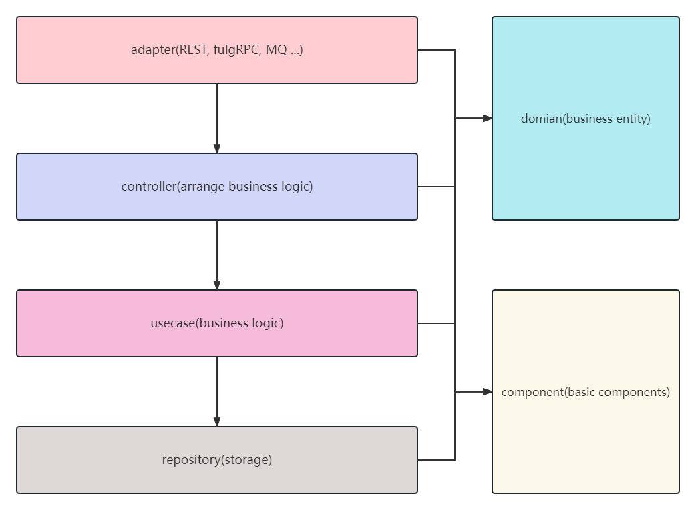

* [介绍](#介绍)
* [分层架构](#分层架构)
* [如何运行](#如何运行)
  * [go build 或 go run](#go-build-或-go-run)
  * [make](#make)
  * [docker\-compose](#docker-compose)
  * [热重启](#热重启)
  * [运行子命令或脚本](#运行子命令或脚本)
* [配置](#配置)
  * [配置模型](#配置模型)
  * [远程配置](#远程配置)
  * [监听配置变更](#监听配置变更)
* [日志](#日志)
* [依赖注入](#依赖注入)
* [如何部署](#如何部署)
  * [Dockerfile](#dockerfile)
  * [docker\-compose](#docker-compose-1)
  * [Kubernetes](#kubernetes)

# 介绍

`go-scaffold` 是一个基于 [cobra](https://github.com/spf13/cobra) 和 [kratos](https://github.com/go-kratos/kratos) 框架的脚手架，基于 [wire](https://github.com/google/wire) 实现功能的组件化

`go-scaffold` 采用[清晰架构](https://blog.cleancoder.com/uncle-bob/2012/08/13/the-clean-architecture.html)，开箱即用，使用简单，可以快速搭建起一个微服务进行业务代码的开发，支持功能：

- [cobra](https://github.com/spf13/cobra) 命令行
- [cron](https://github.com/robfig/cron) 定时任务
- `apollo` 远程配置中心和配置监听
- 日志切割
- 服务注册和发现
- `jaeger` 链路追踪
- `Swagger` 文档生成
- `docker-compose` 和 `Kubernetes` 部署
- 统一的错误处理
- 基于 `wire` 依赖注入的组件化（`db`、`redis` 等）
- ...

# 分层架构



# 如何运行

首先将 `etc/config.yaml.example` 拷贝为 `etc/config.yaml`

## `go build` 或 `go run`

1. `go build` 方式

```shell
$ go generate ./...
$ go build -o bin/app cmd/app/main.go
$ ./bin/app
```

2. `go run` 方式

```shell
$ go generate ./...
$ go run cmd/app/main.go
```

## `make`

```shell
# 下载依赖
$ make download
$ make build

# 或依据平台编译
$ make linux-build
$ make windows-build
$ make mac-build

# 运行
$ ./bin/app
```

## `docker-compose`

`docker-compose` 的启动方式有两种，一种是基于 `air` 镜像，一种是基于 `Dockerfile` 来构建镜像

> 注意：
>
> - 基于 `air` 镜像的方式只适用于开发阶段，请勿用于生产环境
    >   - 在 `Windows` 系统环境下，热更新可能不会生效，这是因为 `fsnotify` 无法收到 `wsl` 文件系统的变更通知
> - 基于 `Dockerfile` 的方式如果用于开发阶段，修改的代码将不会更新，除非在 `docker-compose` 启动时指定 `--build` 参数，但是这将会导致每次启动时都重新构建镜像，可能需要等待很长时间

```shell
# 基于 air 
$ docker-compose -f deploy/docker-compose/docker-compose-dev.yaml up

# 基于 Dockerfile
$ docker-compose -f deploy/docker-compose/docker-compose.yaml up
```

## 热重启

热重启功能基于 [air](https://github.com/cosmtrek/air)

```shell
$ air
```

## 运行子命令或脚本

命令行程序功能基于 [cobra](https://github.com/spf13/cobra)

```shell
$ ./bin/app [标志] <子命令> [标志] [参数]

# 帮助信息

$ ./bin/app -h
$ ./bin/app <子命令> -h
```

# 配置

默认配置文件路径为：`etc/config.yaml`

可以在运行程序时通过 `--config` 或 `-f` 选项指定其它配置文件

## 配置模型

配置文件的内容在程序启动时会被加载到配置模型中

如何使用：

`provider` 函数声明需要注入的配置模型的类型

如：声明需要的配置模型类型：`config.App`

例：

```go
package trace

import "go-scaffold/internal/config"

type Handler struct {
    appConf config.App
}

func NewHandler(
    appConf config.App,
) *Handler {
    return &Handler{
    	appConf: appConf,
    }
}
```

## 远程配置

在启动程序时，可通过以下选项配置远程配置中心

- `--config.apollo.enable`: `apollo` 是否启用
- `--config.apollo.endpoint`: 连接地址
- `--config.apollo.appid`: `appID`
- `--config.apollo.cluster`: `cluster`
- `--config.apollo.namespace`: 命名空间
- `--config.apollo.secret`: `secret`

## 监听配置变更

在 `internal/config/watch.go` 文件的 `watchKeys` 变量中注册需要监听的配置键

注册完成后，如果配置文件内容发生变更，无需重启服务，更改内容会自动同步到配置实例中

例：

```go
var watchKeys = []string{
   "services.self",
   "jwt.key",
}
```

# 日志

日志基于 [slog](https://pkg.go.dev/golang.org/x/exp/slog)，日志的切割基于 [file-rotatelogs](https://github.com/lestrrat-go/file-rotatelogs)

日志内容默认输出到 `logs` 目录中，并且根据每天的日期进行分割

可在程序启动时，通过以下选项改变日志行为：

- `--log.path`: 日志输出路径
- `--log.level`: 日志等级（`debug`、`info`、`warn`、`error`）
- `--log.format`: 日志输出格式（`text`、`json`）

如何获取日志实例：

- 注入类型：`*slog.Logger`

例：

```go
package v1

import "golang.org/x/exp/slog"

type Handler struct {
    logger *slog.Logger
}

func NewHandler(logger *slog.Logger) *Handler {
    return &Handler{
        logger: logger,
    }
}
```

# 依赖注入

> 关于 `go-scaffold` 的依赖注入功能，如果某个组件依赖配置模型的类型，那么在配置文件中必须声明此类型的配置
> 
> 这是为了防止在业务开发中，注入了某个类型，但是忘记对此类型需要的配置模型进行配置，然后在生产环境中因此造成程序的崩溃
> 
> ！！！不建议在程序中直接通过 `config.Get*` 这类函数获取配置模型

# 如何部署

## `Dockerfile`

`Dockerfile` 文件位于项目根目录

## `docker-compose`

`docker-compose` 编排文件位于 `deploy/docker-compose` 目录中

部署前根据需要将 `docker-compose.yaml.example` 或 `docker-compose-dev.yaml.example` 拷贝为 `docker-compose.yaml`，然后根据 [`docker-compose`](#docker-compose) 运行

## `Kubernetes`

`Kubernetes` 编排文件位于 `deploy/kubernetes` 目录中

`Kubernetes` 的方式基于 `helm`，部署前需要将 `values.yaml.example` 拷贝为 `values.yaml`

然后执行：

```shell
$ kubectl apply -Rf deploy/kubernetes

# 或

$ helm install go-scaffold kubernetes/
```
